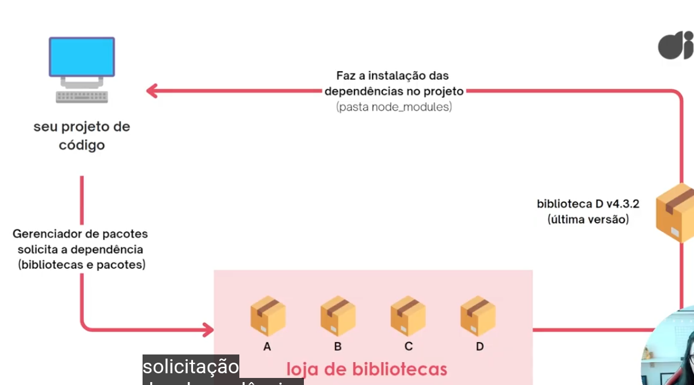
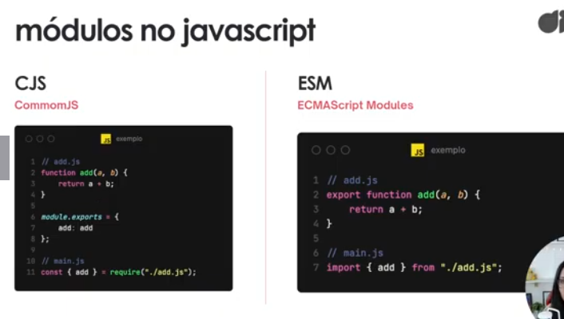

# Bootcamp Santander 2026 - AI React Front-end

## Copilotos com IA no Desenvolvimento de Soluções

### Potencializando Seus Estudos e Carreira com IA (Chatbots, Copilotos e Agentes)

    - Chatbots: Pense no chatbot um consultor disponível 24 horas. Você descreve sua dúvida e ele responde com base no conhecimento que tem. Não existe mágica: a qualidade da resposta depende diretamente da qualidade da sua pergunta.

    - Copilotos: Se o chatbot e um consultor que você procura quando tem uma dúvida, o copiloto é um colega de trabalho sentado ao seu lado. Ele enxerga o que você está fazendo (seu codigo, seu documento, sua planilha) e sugere melhorias em tempo real, sem que você precise parar e perguntar.

    - Agentes: O consultor (chatbot) responde quando você pergunta. O colega (copiloto) sugere enquanto você trabalha. Já o agente é como delegar uma tarefa a alguém de confiança: você explica o que precisa, ele analisa a situação, decide como resolver e executa. Você acompanha o resultado, não cada passo do processo.

### Fundamentos da IA Moderna: Machine Learning, LLMs, IA Generativa e Agentes

    - Como uma IA é treinada e o que são LLMs: O modelo guarda os parâmetros de reconhecimento do que ele esta apredendo.

    - Inferência é um processo de raciocínio no qual se chega a uma conclusão, ou seja, a um conhecimento desconhecido, a partir de premissas ou observações que são consideradas verdadeiras.

    - Deep Learning: é uma área da IA que usa redes neurais de muitas camadas para aprender padrões complexos em grandes volumes de dados de forma autônoma, inspirada no funcionamento do cérebro humano.

    - Multimodal, as IAs são.

    - IAs Generativas: cria conteúdos originais, como textos, imagens, vídeos ou músicas. Ela aprende padrões com dados existentes para gerar novos resultados semelhantes, mas inéditos.

### Introdução à Engenharia de Prompts

    - É a técnica a ser usada na formulação da pergunta, chana-se "prompting".

    - A IA vai te responder baseado no que ela aprendeu durante seu treinamento.

    - Cuidados:
        1. Pode ser ruim perguntas longas ou curtas
        2. Precisa saber que o comprimento de contexto determina o uso de tokens que vc tem direito nas IAs gratuitas.  Então isso determina quanto tempo você pode usar uma    versão gratuita
        3. Prompts Enviesados, Alucinações, Considerações Éticas e Privacidade e Segurança.

## Conceitos Básicos para Começar a Programar em React

### Conhecendo o React

`1. Bibliotecas:` É como ir à sua loja de móveis fav quando você já tem uma
casa. Um conjunto de funções ou utilitários reutilizáveis que você pode 
chamar onde e quando precisar. NÃO DITA O FLUXO do seu programa, mas você sim.
Ex: Efeitos sonoros p/ jogos, formatação de datas, formatação de dados (temperatura, imagem, áudios, etc), desenvolvimento de aplicações frontend (bootstrap, jquery, react).
É um conjunto de código pré-escrito, economizando tempo e esforço nos seus projetos, contendo classes, funções e métodos.
Vantagens: Reutilização de código, Eficiência no desenvolvimento, Padrões de qualidade, Compatibilidade e manutenção, Especialização e domínio de problemas.
Desvantagens: Tamanho do código, Curva de aprendizado, Dependências e problemas de break-changes (mudança em uma biblioteca que quebra a compatibilidade com versões anteriores), Risco de impacto negativo de desempenho, Limitações de personalização.

`2. Frameworks:` É como o modelo de uma casa: conjunto de plantas-baixas e algumas escolhas limitadas em termos de arquitetura e design. Fornece um "esqueleto" para o seu projeto, definindo estrutura, fluxo e regras.
Dentro de um framework, bibliotecas e módulos fornecem funcionalidades pré-desenvolvidas, padrões de projeto orientam a arquitetura do código e segurança integrada protege contra vulnerabilidades. Contém bibliotecas e módulos, padrões de projeto e convenções, segurança integrada.
Vantagens: Produtividade no desenvolvimento, Padronização de código, Reutilização de código, Comunidade e suporte, Integração com outras ferramentas. Ex: Desenvolvimento frontend e backend, desenvolvimento mobile, desenvolvimento de games.


`3. React:` Biblioteca desenvolvida pelo FAcebook para construção de interfaces em diferentes ambientes/dispositivos. 
Vantagens: Funciona em ambientes variados, Construção de aplicações de maneira eficiente, Reatividade e atualizações de interface de forma automática, Peças individuais de interface chamadas de "componentes".

`4. Componentes com código de marcação:` Dividir o código em pequenas estruturas. Tudo fica nos arquivos JSX, ou seja, Javacript XML que é Extenção da sintaxe do JS, ou seja, JS + código de marcação.

`5. Multiplataformas:` React é multiplataformas: Aplicações web com React.js, Aplicações mobile com React Native, Realidade virtual com React VR.

`6. Vantagens do React:` Componentização, Reatividade, Comunidade ativa, SSR, Bibliotecas, Performance.

`7. Desvantagens do React:` Curva de aprendizado, Complexidade, Boilerplate code (termo de algo repetitivo), Decisões de arquitetura, Problemas de SEO.

`8. Pensando do jeito React:` UI: User interface, ou interface do usuário. Passo 1: Quebrar o design em componentes. PAsso 2: Criando uma versão estática em react. Passo 3: Adicionando interações aos componentes.

### Preparando o Ambiente de Desenvolvimento React

### Preparando o Ambiente de Desenvolvimento React

`1. O que é o Node.js:` Assistente que permite que o JS funcione fora do navegador, como em um PC ou servidor. Permite que o JS funcione fora dos navegadores.

`2. A importância do Node.js para o desenvolvimento de aplicações React:` Node.js + React é impotante pois, Ambiente de ezecução JS, Uso de ferramentas como create-react-app e vite, Gerenciamento de pacote, Desenvolvimento local.

`3. Gerenciadores de pacotes:` Ferramentas que permite a instalação, gerenciamento e compartilhamento de bibliotecas e pacotes de código. 


`4. Introdução ao npm:` Node Package Manager, gerenciador de pacotes padrão do Node.js.

`5. Node Package Execute (npx):` Executável do npm que permite executar pacotes Node.js temporariamente, sem a necessidade de instalá-los globalmente. Ele é útil para rodar comandos de pacotes específicos sem a necessidade de instalá-los previamente.

`6. Gerenciador de pacotes Yarn:` Gerenciador de pacotes alternativos ao npm. `-d` adiciona o pacote como dependência de desenvolvimento.

`7. Gerenciador de pacotes pnpm:` É um gerenciador de pacotes alternativo para Node.js, cujo nome significa Performant NPM.

`8. Ferramentas online para criar projetos em React:` StackBlitz, CodeSandbox

### Empacotadores e Compiladores do React

`1. Compiladores:` Ferramentas que traduzem código de uma linguagem de programação para outra. No contexto das aplicações front-end, faz com que seu projeto possam ser acessíveis por diferentes versões de navegadores e dispositivos mais antigos. São essenciais pois: Copatibilidade com navegadores, Permite o uso de recursos de código moderno, Otimização e minificação, Preparação do projeto para produção.

`Transpiladores:` Converte código-fonte de uma linguagem para outra linguagem de mesmo nível de abstração.

`2. Linguagens de Saída do Compilador Js, Estágio de Comp:` Diferentes compiladores podem transformar o código em diferentes linguagens de programação, Compiladores com saídas binárias (0s ou 1s), Conversão de código em versões mais antigas da mesma linguagem de programação, Compilação para a mesma linguagem de programação, ex: typescript e babel.
Em JS opera em estágios: Interpreta o código JS para executá-la rapidamente, O compilador otimiza partes frequentes ou repetidas do código, Partes otimizadas do código são transformadas em código de máquina para melhorar o desempenho.

`3. Linguagens Interpretadas e Compilador JIT:` JS é uma linguagem de programação INTERPRETADA. É código-fonte são traduzidas linha por linha para uma representação de código de máquina antes da execução, em tempo real.


`Compilador JIT (Just in Time):` Um compilador JIT é responsável por traduzir o código fonte do programa em código de máquina executável, Utiliza informações sobre o contexto de execução para decidir quais partes do código devem ser compiladase executadas em tempo real, Identifica partes do código que são executadas com frequências e as otimizam um desempenho máaximo.

`4. Babel, Compilador JS:` Babel: Ferramentas usada principalmente para converter código ECMAScript 2015+ em uma versão compatpivel com versões anteriores do JS em navegadores ou ambientes atuais e mais antigos. Benefícios: Transformar sintaxe, Preencher recursos ausentes, Transformação de código-fonte (Codemods), Otimizações de código, plugins e mais. O babel possui presets, que são conjuntos predefinidos de plugins que configuram o Babel para lidar com determinados tipos de transformação de  código.

`5. Módulos JS:` Com o aumento das aplicações JS, surgiu a necessidade de dividir nossos códigos em módulos que podem ser importados quando necessário. Benefícios: Escopo e responsabilidade única, Os módulos estão presentes no Node.js, Maioria dos navegadores dão suporte aos módulos.

`6. CommonJS (CJS) e EcmaScript Modules (ESM):` CJS: Especificação para módulos em JS, usada principalmente em ambientes de servidor, como Node.js. 

ESM: Mais comumente utilizado em ambientes de navegador modernos e em algumas ferramentas de desenvolvimento front-end.



`7. Processo de Empacotamento (bundling):` Bundling (empacotamento) é um processo que resolve as dependências de arquivos e junta os módulos de uma aplicação dentro de pacotes para o navegador, para poder reduzir o número de requisições por arquivo quando o usuário abre a página.Conforme a aplicação cresce, o seu bundle (pacote) também cresce. Quanto maior o arquivo de bundle, mais tempo demora para o site carregar para o usuário.

`8. Características do bundlers (empacotadores):` O processo de empacotamento é feito pelos bundlers. Características que os tornam bundlers necessários: Complexidade do desenvolvimento, Dependências e bibliotecas, Otimização de carregamento, Gestão de recursos estáticos.

`9. Compilador e Empacotadores - Quem Realiza a Otimização de Código do Nosso Projeto:` Geralmente, os bundlers se concentram em otimizações específicas para o processo de empacotamento e carregamento de código, enquanto os compiladores realizam otimizações mais abrangentes durante o processo de transpilação do código-fonte.

`10. Conhecendo o Webpack (bundler):` Empacotador de módulos para desenvolvimento web. 

`11. Conhecendo o Esbuild (bundler):` Empacotador e minificador JS. Enpacota o código JS em um único arquivo. Funções do esbuild: Resolver módulos, Relatar problemas de sintaxe, Tree-shaking (remover funções não utilizadas), Eliminar declarações de log e depuração; Minificar o código, Outros.
Em arquivos css: Codificação de ativos embutidos, Mapas de origem (source maps), Prefixação automática.
O esbuild oferece um servidor de desenvolvimento local com empacotamento automático e recarga rápida.

`12. React, babel e webpack na prática- Criando a estrutura base do projeto:` 
```cmd
npm init -y
npm install react react-dom
```
Cria duas pastas: public e src, dentro de cada uma coloca estes arquivos:

- public: index.html
- src: App.jsx, index.js

`13. React, babel e webpack na prática- Criando a estrutura do React:`

ARQUIVO NA PASTA REACT, BABEL E WEBPACK

`14. React, babel e webpack na prática- Instalando as dependências do webpack:`
```cmd
npm install --save-dev webpack webpack-cli webpack-dev-server html-webpark-plugin
```

`15. React, babel e webpack na prática- Configurando entry point e output do webpack:`

ARQUIVO WEBPARK.CONFIG.JS

`16. React, babel e webpack na prática- Configurando entry point e output do webpack:`
```cmd
npm install --save-dev babel-loader
```

No arquivo package.json, na parte de script, adicionar:
```json
"scripts":
    "start": "webpack server --mode development",
    "build": "webpack --mode production",
    "test": "echo \"Error: no test specified\" && exit 1"
```

`17. React, babel e webpack - Configurando o babel, subindo o servidor local e gerando o build da aplicação:`
```cmd
npm install --save-dev @babel/core @babel/preset-env @babel/preset-react
```

`18. React e esbuild - Criando a estrutura do react:`
```cmd
npm init -y

npm install react react-dom

npm install --save-dev esbuild
```

`19. Projeto Hands-On: Automatizando o build e Servidor de Aplicações React para o setor de comunicação e mídia:`

No arquivo package.json, na parte de script, adicionar:
```json
"scripts":
    "build": "esbuild src/index.js --outfile=dist/dundle.js --loader:.js=jsx --bundle --minify",
    "test": "echo \"Error: no test specified\" && exit 1"
```

tem que gerar manualmente o arquivo index.html dentro da pasta dist

`20. React e esbuild - Configurando servidor de desenvolvimento:`
No arquivo package.json, na parte de script, adicionar:
```json
"scripts":
    "start": "esbuild src/index.js --outfile=dist/dundle.js --loader:.js=jsx --bundle --minify --serve --servedir=dist  --watch",
    "build": "esbuild src/index.js --outfile=dist/dundle.js --loader:.js=jsx --bundle --minify",
    "test": "echo \"Error: no test specified\" && exit 1"
```

em --serve você pode escolher a porta que quer usar, por exemplo: --serve=3000

### Criando Aplicações React com Create React App

### Criando Aplicações React com Vite

## Entendendo Componentes em React do Zero

## Componentes em React na Prática

## Projeto Final: Educador Financeiro Inteligente